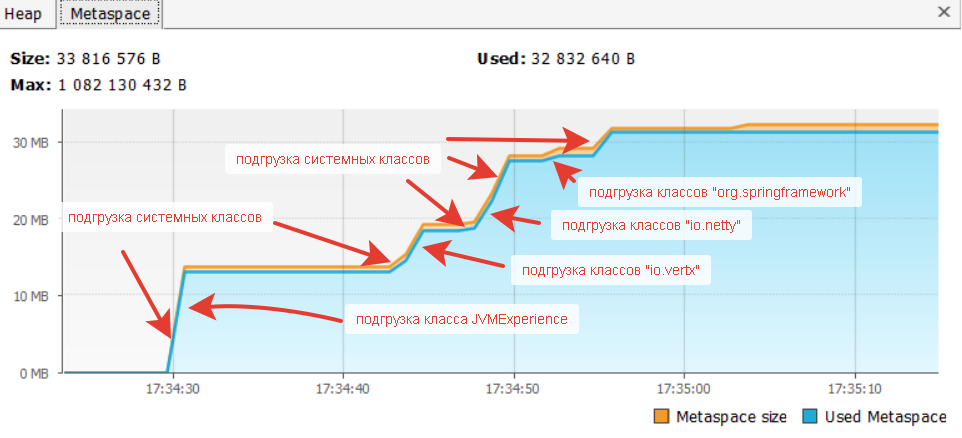

# **Задача "Исследование JVM через VisualVM"**

# **Условие**

Предлагаем вам изучить использование памяти через VisualVM при загрузке новых классов и создании новых объектов
Запульте и запустите проект [отсюда](https://github.com/Arsennikum/jvm-visualvm-experience). 
Перейдите на вкладку `Monitor` и можете наблюдать метрики программы в реальном времени. Присмотритесь к разделам `Heap`, `Metaspace`
Когда программа завершится, изучите вывод консоли и код программы (в код можете не погружаться, главное - метод main). Соотнесите с графиками в разделах `Heap`, `Metaspace` и `Classes`
Сделайте скриншоты графиков и отметьте на них с помощью простого графического редактора и текста, в какие моменты какие действия программы происходили.  
Для выполнения задания нужно отметить на таймлайне графиков каждую строку, которую вывела в консоль программа и пояснить её своими словами в тексте  
Данные скриншоты и текст отправьте в качестве домашнего задания (их также можно добавить в репозиторий. Для текста можете использовать формат Markdown)

## **Решение**

### **Результат работы программы**

```

17:34:12: Executing task ':JvmExperience.main()'...

> Task :compileJava UP-TO-DATE
> Task :processResources NO-SOURCE
> Task :classes UP-TO-DATE

> Task :JvmExperience.main()
Please open 'ru.netology.JvmExperience' in VisualVm
17:34:43.392304400: loading io.vertx
17:34:44.201963: loaded 529 classes
17:34:47.215538500: loading io.netty
17:34:48.863118900: loaded 2117 classes
17:34:51.875909400: loading org.springframework
17:34:52.395948200: loaded 869 classes
17:34:55.403976500: now see heap
17:34:55.404977500: creating 5000000 objects
17:34:56.110363300: created
17:34:59.119079700: creating 5000000 objects
17:34:59.681358900: created
17:35:02.860339: creating 5000000 objects
17:35:03.516171700: created

BUILD SUCCESSFUL in 54s
2 actionable tasks: 1 executed, 1 up-to-date
17:35:07: Task execution finished ':JvmExperience.main()'.
```


### **Вкладка Classes**

На графике указано количество классов, используемых программой:


### **Вкладка Heap**

На графике стрелками указаны моменты подгрузки объектов в кучу (heap):


### **Вкладка Metaspace**

На графике стрелками указаны моменты подгрузки классов в Metaspace:



